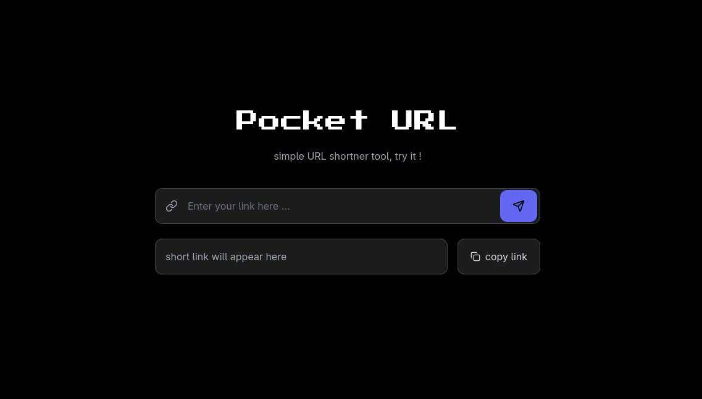

<p align="center">
  
</p>

# Pocket URL 

**Pocket URL** is a minimal, 1-day project I did to learn APIs and Deployment using Render and subdomains.
this website shortens lengths of your links...

Live Demo : **https://s.vitthalhumbe.me**


## Features

- Generate short URLs from long links
- Instant redirection using short codes
- Click count analytics
- MongoDB persistence
- Custom domain support
- Clean, minimal UI


## Tech Stack

|Domain|Tools|
|------|-----|
|Frontend| HTML, Tailwind CSS|
|Backend|Node.js, MongoDB|
|Deployment|Render|


## Environment Variables

Create a `.env` file in the root directory:

```env
MONGO_URI=your_mongodb_connection_string
BASE_URL=<localhost_URL>
```

## Run Locally 
```bash
git clone https://www.github.com/vitthalhumbe/url_shortner.git
cd url_shortner
npm install
npm run dev
```

open in broswer : http://localhost:3000

## License

This project is open source... !!


